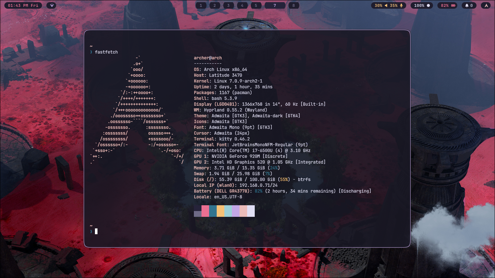
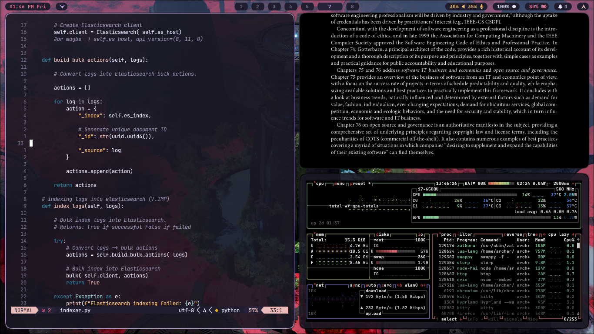
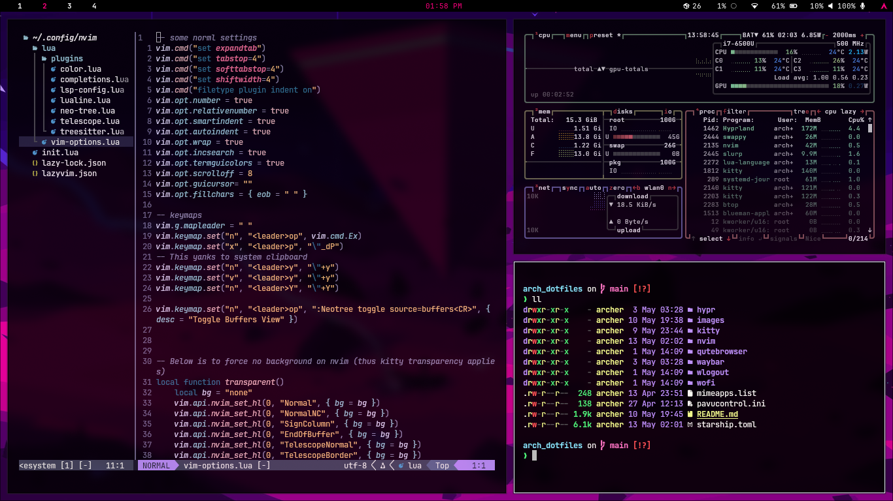
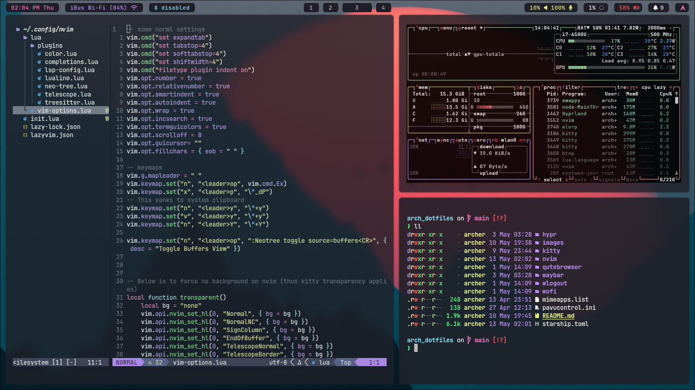
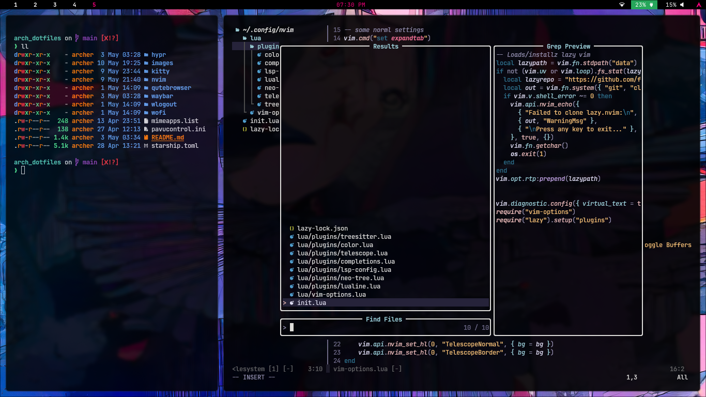
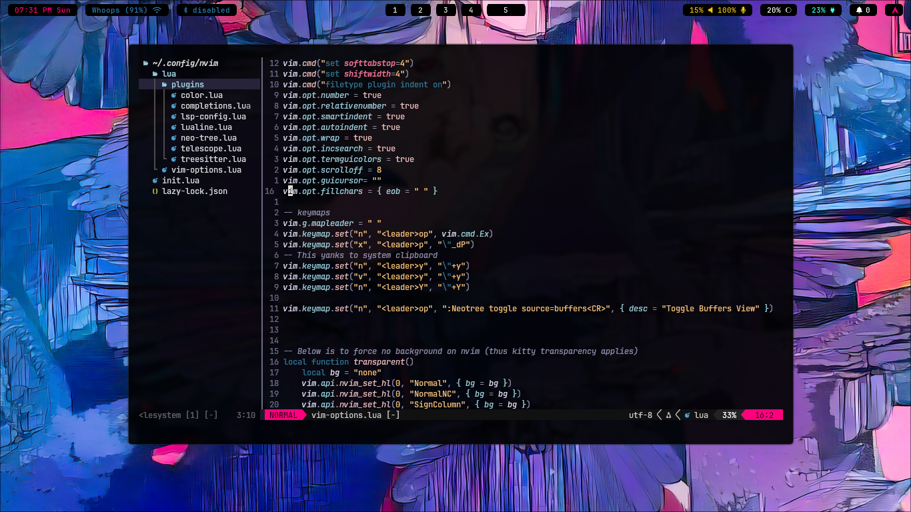
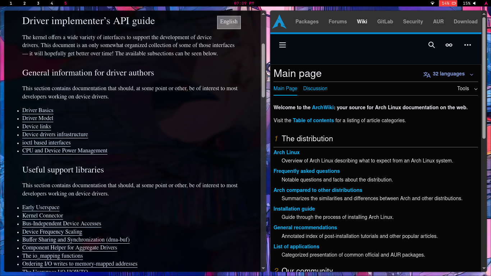
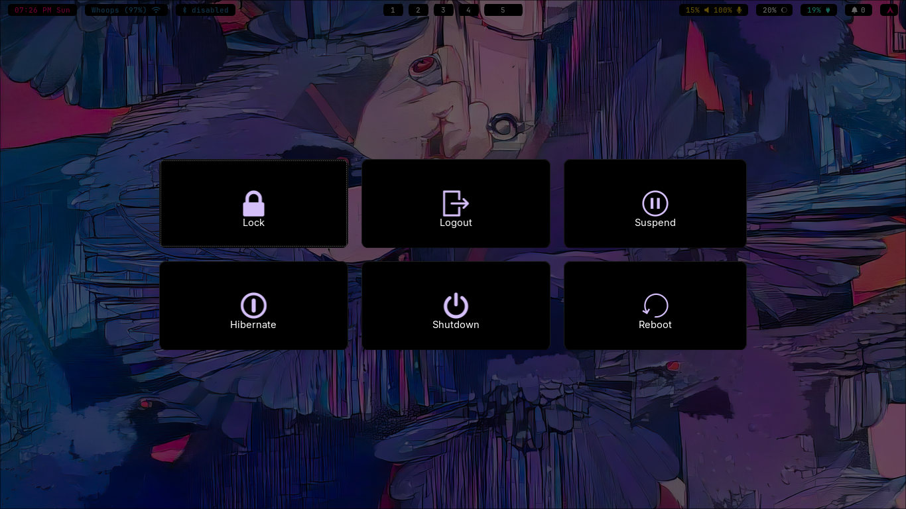
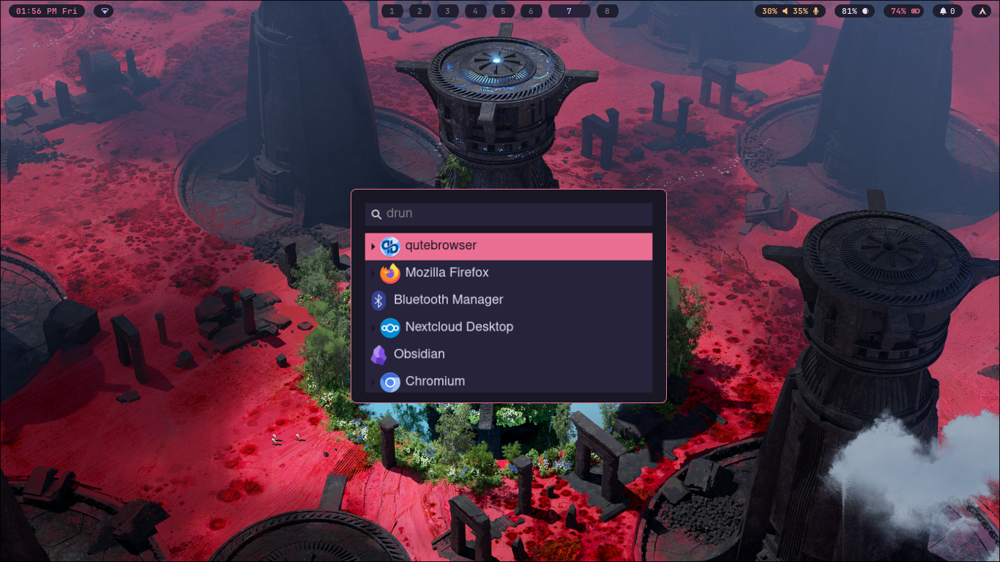

# Arch BTW

I’ve been daily driving Arch Linux for the last couple of years...

Everything is built and configured from scratch, no unnecessary bloat, no hidden abstractions, just a system tuned exactly the way I want it. That level of control over performance, workflow, security, and resource usage is what makes Arch unbeatable for me. Gives second lives to devices that were rejected by microslop.

## Setup Highlights

* Minimal and fully customized Arch installation
* Lightweight and fast workflow powered by Hyprland tiling manager
* Highly optimized terminal centric environment
* System-wide Vim motions and custom keybindings
* Custom-configured Neovim setup capable of replacing traditional IDEs, with tree-siiter, neo-tree, LSP, automplete, tags, fuzzy finder etc...
* Keyboard-driven browsing with qutebrowser

Using Vim bindings everywhere — terminal, browser, file manager, editor, launchers — creates a seamless workflow where navigation becomes muscle memory.

The result is a setup that feels:

* Faster
* Cleaner
* More focused
* Extremely efficient on resources

This environment has been refined over many sleepless nights of trial, error, optimization, and customization.

---

# Screenshots

## Fastfetch

---

## Mixed Rice

---

## Neovim + FZF

---

## Neovim

---

## Qutebrowser

---

## Wlogout

---

## Wofi

